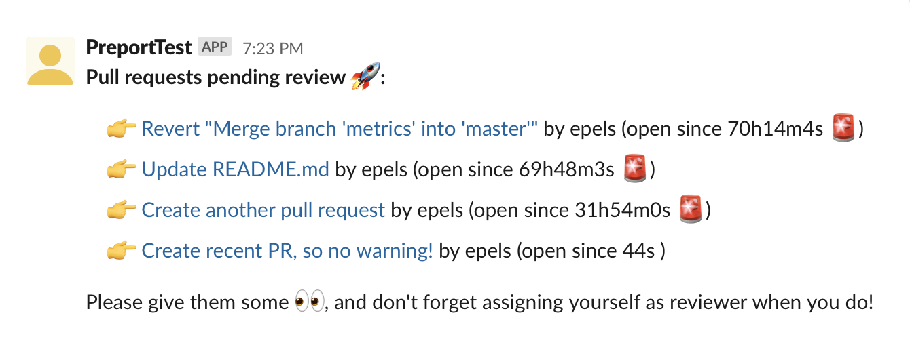

# preport

Born out of a desire to get pull requests reviewed faster without having to send manual reminders, preport generates reports of GitLab pull requests pending review and notifies your team on Slack.

Goals:

* Short-lived process that is easy to run at an interval, e.g. as a cronjob
* Customizable formats for reporting
* Support many channels with many repositories with very simple configuration

Next steps:

* Expand this README
* Write docs for setting up
* Add example manifest for Kubernetes CronJob
* Automate building and pushing container images
